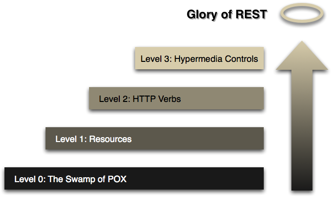
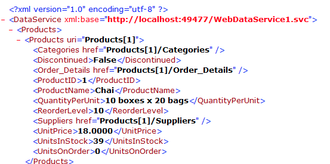

# Le Modèle de Maturité de Richardson

[https://www.crummy.com/writing/speaking/2008-QCon/act3.html](https://www.crummy.com/writing/speaking/2008-QCon/act3.html) \(2008\)



**\*P.O.X.** : Plain Old XML

## Level 0 : The Swamp of POX

XML-RPC over HTTP.




## Level 1 : Resources

L’API respecte le modèle de données et chaque ressource peut être identifiée avec une URL.

```http
POST /blogs/11111/posts
POST /posts/22222/comments
GET /comments/33333
```


## Level 2 : HTTP Verbs

Utilisation des méthodes HTTP autres que GET et POST pour signifier l’action souhaitée : PATCH / PUT / DELETE.

… et surtout les “status codes” HTTP pour résumer le résultat de l’opération :

**200** : OK  
**201** : Created  
**204** : No Content \(delete\)  
**400** : Bad Request  
**401** : Unauthorized  
**403** : Forbidden  
**404** : Not Found  
**409** : Conflict  
…

Bien sûr, les erreurs 4xx peuvent contenir un "body" avec des informations additionnelles.


Utilisez le bon vocabulaire et évitez les APIs schtroumpf !

```http
SCHTROUMPF /q?data=select:*:from:carts
```



## Level 3 : Hypermedia Controls

Hypermedia est l’une des principales règles de la thèse de Fielding.

L’idée est de retrouver dans les API ReST la même logique Hypermedia qu’en HTML par exemple. Aujourd’hui, cela se résume principalement par la présence de liens dans les ressources permettant de définir la relation avec d’autres ressources.

L’API ReST devient alors "**discoverable**".

