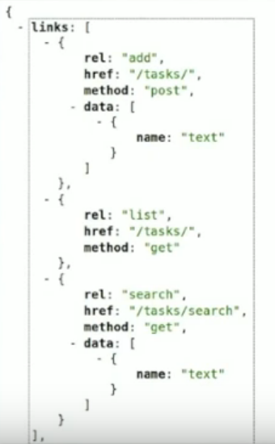
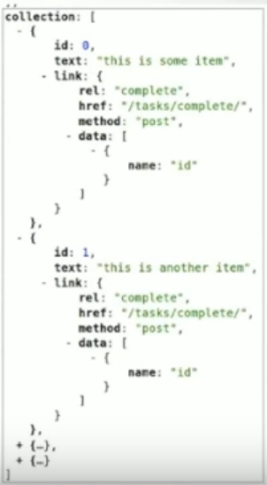

# Avis Subjectif sur H.A.T.E.O.A.S. et le Semantic Web


C’est tout beau…

…mais comment cela s’intègre dans la pratique ?

Supposons que nous disposions des objets et méthodes suivantes :

```javascript
/* GET https://api-v1.wishtack.com/users/SOME_USER_ID */
userStore.getUser({userId: 'SOME_USER_ID'});

/* GET https://api-v1.wishtack.com/users/SOME_USER_ID/wishes */
wishStore.getWishList({userId: 'SOME_USER_ID'});
```

Supposons maintenant que l’API réponde avec les données suivantes :

```javascript
{
  "href": "https://api-v1.wishtack.com/users/SOME_USER_ID",
  "wishes": {
    "href": "https://api-v1.wishtack.com/users/SOME_USER_ID/wishes"
  }
}
```

Comment faire pour réutiliser la méthode `WishStore.getWishList` ?

Faut-il ajouter une méthode `WishStore.getWishListByUrl` ?

Que faire en cas d’incohérence ?

* Les données ne sont pas proprement canonicalisées.
* Les URLs sont dupliquées et occupent une grande partie du contenu. Comment factoriser ?
* Comment récupérer l'"id" si on ne souhaite pas utiliser le "href" comme "id".
* Une URL est une information qui perd en canonicalisation. Une façon plus canonique de décrire une ressource serait la suivante :

  ```javascript
  {
    "baseUrlList": ["https://api.wishtack.com", "https://api-backup.wishtack.com"],
    "resourcePath": [
      {"id": "USER_ID", "type": "user"},
      {"id": "WISH_ID", "type": "wish"}
    ]
  }
  ```

* Comment basculer automatiquement d’une API principale à une API de backup sans “parser” et reconstruire l’URL ?
* Peut-on faire **confiance à une API au point d’utiliser naïvement les URLs qu’elle nous transmet** ?
* Il nous faudrait idéalement les informations suivantes :
  * "id" de la ressource.
  * "type" de la ressource ou encore mieux un référentiel de type. [I.A.N.A.](https://www.iana.org/) ?
  * Mapping "type" =&gt; informations sur la construction de l’URL _\("Base URL"  et "Path"\)_.
  * Affordances : que puis-je faire avec la ressource ? A quoi correspond-elle ?

C’est tout simplement l’utopie _\(ou le futur ?\)_ du Web Sémantique. **Cela nécessite des standards de canonicalisation des données et une adoption importante.**

Pour le moment, on ne trouve que quelques tentatives qui ressemblent plus à de l’**HTMLisation du ReST** et on y retrouve des noms familiers : **Richardson**, **Amundsen** et **Foster**.

Application-Level Profile Semantics : [http://alps.io/spec/drafts/draft-01.html](http://alps.io/spec/drafts/draft-01.html)

Intéressant mais assez loin des conventions ReST et du pragmatisme qui nous intéresse.






