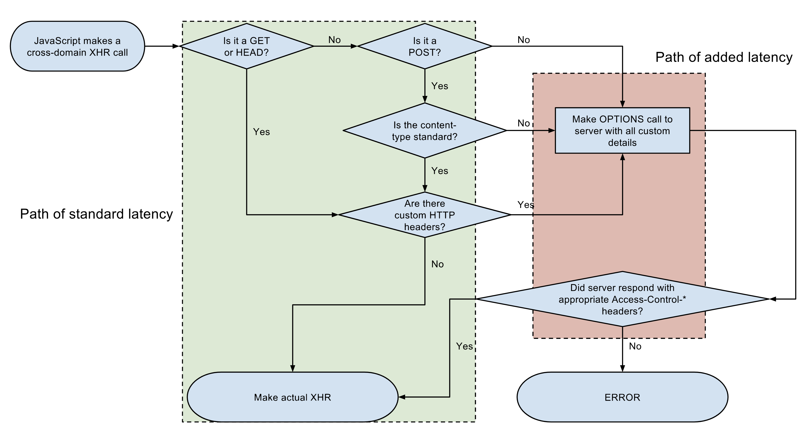

# C.O.R.S.

## Définitions

Cross-Origin Resource Sharing. [https://www.w3.org/TR/cors/](https://www.w3.org/TR/cors/)

L’ "origin" _\(_[_https://tools.ietf.org/html/rfc6454_](https://tools.ietf.org/html/rfc6454)_\)_ est composé des éléments suivants :

* Scheme : http / https / …
* FQDN : www.attacker.com / api.target.com / …
* Port : 80 / 443 / 8000

## Fonctionnement

Supposons que nous avons deux “origins” : [https://attacker.com](https://attacker.com) et [https://target.com](https://target.com).

### GET ou FETCH

Par défaut, si l’application [`https://attacker.com`](https://attacker.com/) émet une requête `GET` depuis le browser _\(en JavaScript\)_ vers l’ "origin" [`https://target.com`](https://target.com/), celle-ci ne **transmettra aucun des cookies des deux "origins"**.

Le browser analysera ensuite certains "headers" C.O.R.S. _\(que nous verrons plus tard\)_ mais en leur absence, il ne transmettra pas la réponse à l’application.  
`Error: No 'Access-Control-Allow-Origin' header is present on the requested resource`

### Autre

S’il s’agit d’une requête **autre que `GET`** _\(ou similaire `HEAD`…\)_ le "browser" envoie une "preflight request" de type `OPTIONS` pour vérifier si la requête est autorisée en fonction de l’ "origin" et de la méthode utilisée.

## Méfiez-vous des Fausses Solutions 

Ces mécanismes ont été mis en place pour éviter les attaques de type C.S.R.F _\(Cross Site Request Forgery\)_.

Malheureusement, le premier résultat sur lequel on tombe en recherchant le message d’erreur est le suivant :  
[https://stackoverflow.com/questions/20035101/why-does-my-javascript-get-a-no-access-control-allow-origin-header-is-present](https://stackoverflow.com/questions/20035101/why-does-my-javascript-get-a-no-access-control-allow-origin-header-is-present)

On y trouve les propositions suivantes :

* “The easy way is to just add the extension in google chrome to allow access using CORS.” [https://chrome.google.com/webstore/detail/allow-control-allow-origi/nlfbmbojpeacfghkpbjhddihlkkiljbi?hl=en-US](https://chrome.google.com/webstore/detail/allow-control-allow-origi/nlfbmbojpeacfghkpbjhddihlkkiljbi?hl=en-US) 
* `chrome.exe --user-data-dir="C:/Chrome dev session" --disable-web-security` 
* “It’s very simple to solve if you are using PHP. Just add the following script in the beginning of your PHP page which handles the request:” `<?php header('Access-Control-Allow-Origin: *'); ?>`

## Sauvés par le C.O.R.S.

Après la mise en place du "header" `Access-Control-Allow-Origin: *`, la requête émise depuis l’ "origin" [`https://attacker.com`](https://attacker.com/) vers  [`https://target.com`](https://target.com/) ne contient pas de cookies.

Il faut activer l’option `withCredentials` de l’objet XHR ou de la fonction `fetch`.

La **requête est alors envoyée avec les cookies** mais encore une fois les spécifications C.O.R.S. sont rigoureuses et **il n’est pas possible de récupérer le contenu de la réponse** si le "header" `Access-Control-Allow-Origin` vaut `*`.

Pour pouvoir transmettre des cookies et récupérer la réponse, il faut configurer le "header" **`Access-Control-Allow-Credentials`** mais encore une fois, heureusement que ce n’est pas suffisant. **Cette fonctionnalité ne peut pas être activée si `Access-Control-Allow-Origin` vaut `*`**.

Il faut donc définir une "whitelist" d’ "origins" mais malgré tous ces obstacles volontaires, certains vont jusqu’au bout…  
[http://stackoverflow.com/questions/26411480/angularjs-a-wildcard-cannot-be-used-in-the-access-control-allow-origin-he](http://stackoverflow.com/questions/26411480/angularjs-a-wildcard-cannot-be-used-in-the-access-control-allow-origin-he)


Please don’t!!!


Après cette ultime étape, n’importe quelle application depuis n’importe quel "origin" peut communiquer librement avec votre API en utilisant les "credentials" présents dans les "cookies" de l’utilisateur actuellement authentifié.

Par précaution, même en l’absence de "cookies", il vaut mieux éviter d’utiliser la valeur `*` pour le "header" `Access-Control-Allow-Origin` sauf dans le cas d'une API publique.

Il est préférable d’implémenter une logique de "whitelist" sur l’API qui vérifie le contenu du "header" `Origin` de la requête et le renvoie dans le "header" `Access-Control-Allow-Origin` de la réponse en cas d’autorisation réussie.

**La vérification de la "whitelist" doit être stricte !** Il ne suffit pas de vérifier le FQDN.


Pensez à implémenter une règle sur votre W.A.F. \(Web Application Firewall\), middlewares ou monitoring sécurité pour détecter et bloquer les réponses HTTP contenant le “header” `Access-Control-Allow-Credentials`.



**Attention ! Les certificats clients et l’authentification de type "basic auth" sont également considérés comme des "credentials"** et on rencontre les mêmes problèmes qu’avec les "cookies".


