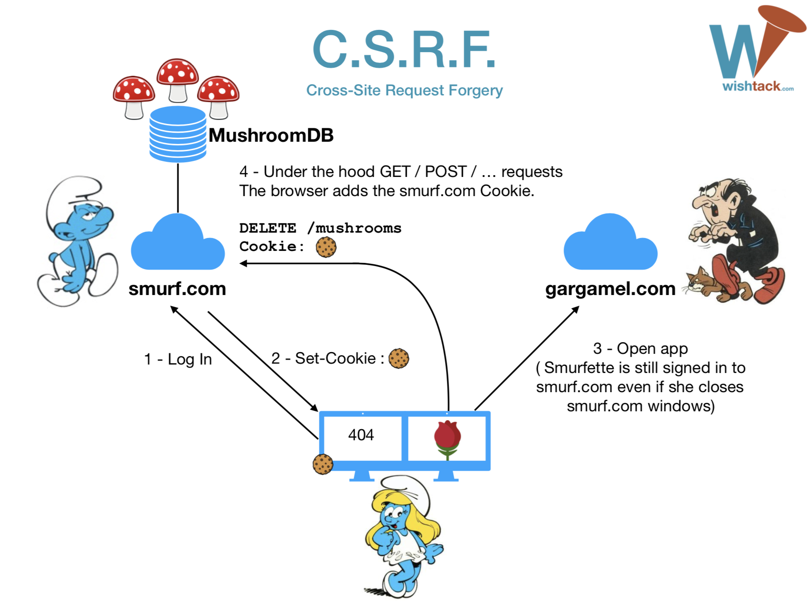

# C.S.R.F.

**Cross-Site Request Forgery** est une attaque _in-the-browser_ dont le scénario est le suivant :

1. Un utilisateur _\(victime\)_ doit être authentifié sur l’application vulnérable. 
2. L'attaquant doit réussir à **faire visiter une application** qu’il contrôle _\(entièrement ou partiellement\)_ par la victime. 
3. Lors de la visite de la victime, **l'attaquant déclenche une opération sur l’application vulnérable** en utilisant implicitement les _credentials_ de la victime. _On suppose qu’une requête de type GET ne peut pas déclencher d’opération sensible car autrement il suffirait de rediriger l’utilisateur vers l’URL en question._ 
4. Si les règles C.O.R.S. sont désactivées par l’un des moyens décrits dans le chapitre C.O.R.S., l'attaquant peut simplement déclencher une requête POST de son choix à destination de l’application vulnérable en utilisant les _credentials_ de la victime.


Si la _whitelist_ d'origins n’effectue pas une vérification rigoureuse, l'attaquant pourrait éventuellement contrôler le domaine **http** de l’application vulnérable en ciblant le domaine **https** de l’application vulnérable.


