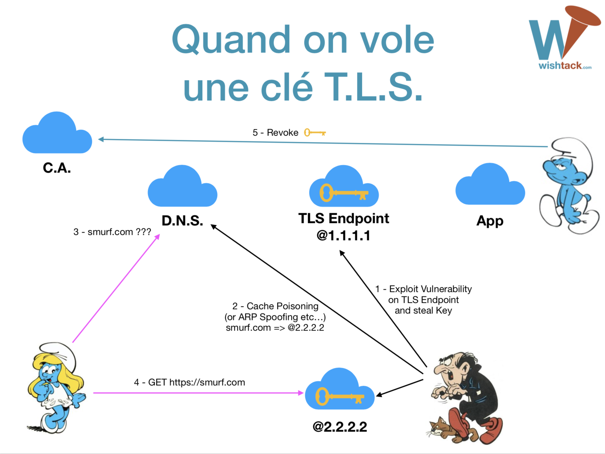
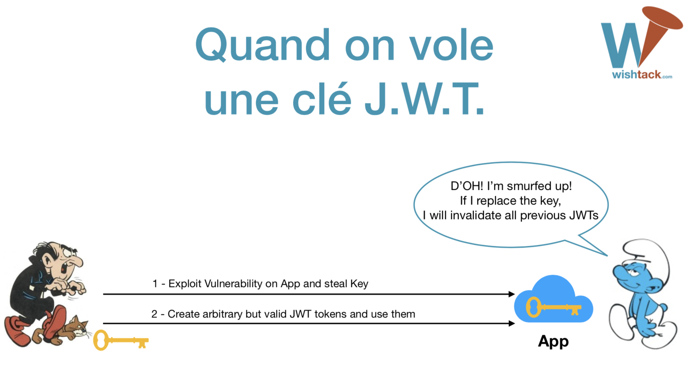

# JWT, Authentification, Sessions et Risques Sécurité

Avant d’aborder les aspects sécurité, les tokens JWT utilisés pour l’authentification ou la gestion de session sont accompagnés des problèmes suivants :

* **Taille importante** _\(particulièrement en activant le chiffrement\)_. 
* **Immutabilité des claims**. Il faut générer de nouveaux de tokens JWT pour transmettre les valeurs mises à jours des **claims**. 
* **No key policy.**  JWT ne définit aucune contrainte de sécurité concernant la gestion des clés _\(génération des clés symétriques, rotation des clés etc…\)._ 
* **HMAC n’est pas un algorithme de signature.** De nombreuses documentations et implémentations utilisent le HMAC pour authentifier les tokens JWT en parlant de signature. 
* **Pas d’invalidation.** Bien que les tokens JWT peuvent contenir une date d’expiration, JWT ne peut définir aucun moyen pour révoquer ou invalider un token JWT.
  * Euh… comment gérer le "logout" ?
  * La seule solution possible est de stocker une information quelque part _\(liste des tokens invalidés, heure de logout, etc…\)_
  * Cela nécessite alors de vérifier cette information à chaque présentation d’un token. On perd alors la plus grande partie de l’intérêt de l’utilisation des tokens JWT.

## **Politique de sécurité des clés privées TLS**

Analysons la politique de sécurité généralement associée aux clés privées TLS.

Il est généralement recommandé _\(et de plus en plus pratiqué\)_ d’utiliser une machine dédiée au chiffrement/déchiffrement des échanges TLS. Ainsi, si une application est compromise, **la clé privée en mémoire n’est pas dévoilée**.

Les clés sont **renouvelées régulièrement**.

**Les clés sont protégées par des passphrases** qui nécessitent parfois la présence de plusieurs personnes qui détiennent différentes parties de la passphrase.

Que se passe-t-il en cas d’usurpation d’une clé privée TLS ?

* L’attaquant doit combiner cette attaque avec une attaque de type Man-In-The-Middle _\(ARP Poisoning, DNS Cache Poisoning…\)_. 
* L’attaquant ne pourra impacter généralement qu’une partie géographique donnée et uniquement les utilisateurs connectés pendant la durée de l’attaque. 
* Dès détection, il est possible de révoquer rapidement le certificat associé et grâce à des protocoles tels que l’OCSP, les clients refuseront ce certificat. [https://tools.ietf.org/html/rfc6960](https://tools.ietf.org/html/rfc6960)

## **Risque d’usurpation des clés privées JWT**

Analysons maintenant une mise en place classique d’une authentification JWT.

La clé privée du serveur d’authentification est malheureusement souvent stockée dans une variable d’environnement, une base de données ou encore un fichier _\(en espérant qu’il ne finisse pas sur le Version Control System\)._  
[https://github.com/mitreid-connect/OpenID-Connect-Java-Spring-Server/wiki/Key-generation](https://github.com/mitreid-connect/OpenID-Connect-Java-Spring-Server/wiki/Key-generation)  
[http://django-oidc-provider.readthedocs.io/en/v0.4.x/sections/serverkeys.html](http://django-oidc-provider.readthedocs.io/en/v0.4.x/sections/serverkeys.html)

La clé privée peut être dévoilée de différentes façons :

* Accès au Version Control System.
* Injection SQL.
* Insecure remote file access.
* Dump des variables d’environnement en cas d’erreur.

Si l’attaquant récupère la clé privée, il peut simplement forger des tokens JWT avec des **claims** arbitraires. Il peut alors récupérer les données de tous les utilisateurs dont l’authentification repose sur JWT.

## **`none` alg**

Malheureusement, un token JWT peut également utiliser un algorithme **`none`** qui n’est donc ni chiffré ni signé.

L’attaquant peut donc forger des tokens JWT avec la valeur **`none`**pour la propriété **`alg`**.

Si l’implémentation de vérification du token se base sur la propriété **`alg`**, elle est alors vulnérable et peut éventuellement accepter des tokens utilisant l'**`alg`** **`none`**.

## `Alg` swapping

Certaines implémentations peuvent être vulnérables à une attaque qui consiste à utiliser la valeur **`HS256`** pour la propriété **`alg`**. **L’implémentation utilise alors la clé publique RSA comme clé symétrique pour vérifier le HMAC.**

* [https://auth0.com/blog/critical-vulnerabilities-in-json-web-token-libraries/](https://auth0.com/blog/critical-vulnerabilities-in-json-web-token-libraries/)

