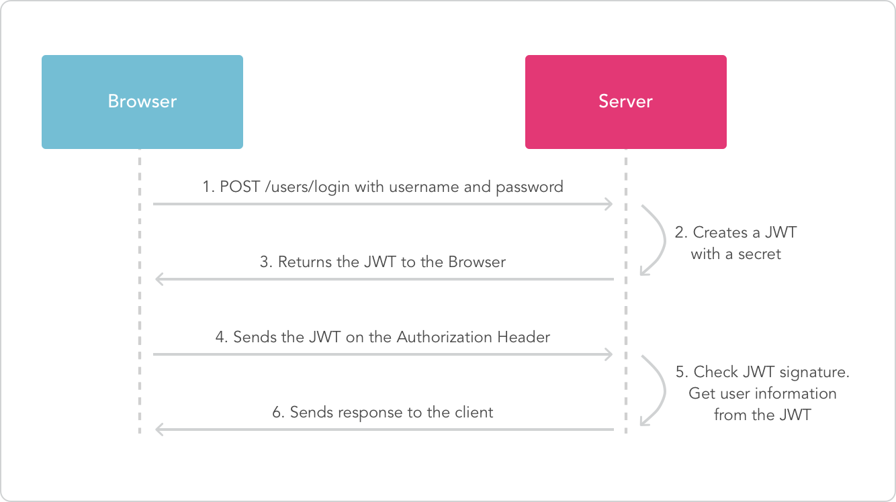
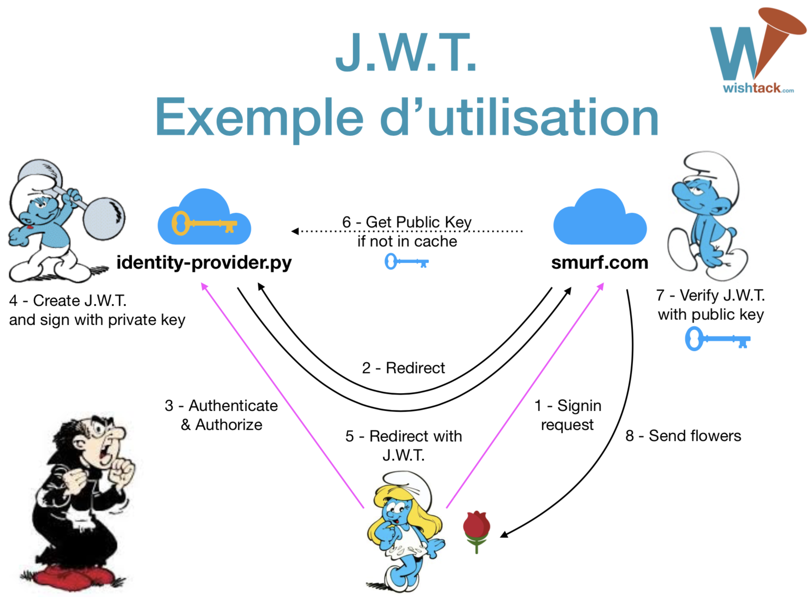

# Utilisation de JWT pour l’Authentification

Vu que le token JWT contient toutes les informations nécessaires concernant l’identité du **Resource Owner** et qu’il est signé, il n’est pas nécessaire de vérifier le **token** auprès d’une base de données ou un service distant. Cela peut **augmenter considérablement les performances et la "scalability"** du service si aucun autre mécanisme _\(de cache par exemple\)_ n’est mis en place.

La plupart des tokens JWT contiennent des informations liées à au **Resource Owner** et sont le plus souvent stockées sur le device de l’utilisateur _\(E.g. : Local Storage\)_.


Il est donc recommandé de générer des tokens JWT signés puis chiffrés mais cela augmentera considérablement la taille du token qui sera envoyé à chaque requête authentifiée.


