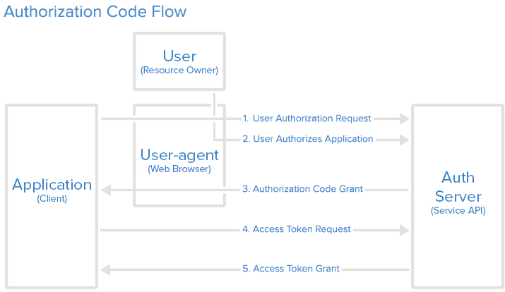

# OAuth 2 Authorization Code Flow



1. Le **Client** redirige le **Resource Owner** vers l'**Authorization Server** :

```javascript
https://accounts.google.com/o/oauth2/v2/auth?
response_type=code
&client_id=CLIENT_ID
&redirect_uri=https://cal-tracker.wishtack.io/oauth/callback // optional
&scope=email,calendar:read
&state=... // state is recommended thus optional 😢
```

* **`client_id`** : ID unique du **Client**.
* **`redirect_uri`** : Une des URLs de retour parmi la liste transmise à l'**Authorization Server** à l'enregistrement. Si le paramètre est absent, l'**Authorization Server** utilisera la valeur par défaut configurée lors de l'enregistrement.
* **`scope`** : liste des autorisations demandées.
* **`state`** : Paramètre malheureusement optionnel permettant au **Client** de retrouver le contexte d'initiation de la demande. Il sert surtout à transmettre un "nonce" _\(token aléatoire\)_ pour des raisons de sécurité.
* Le **Resource Owner** confirme ou rejette les autorisations d’accès demandées sur l’interface proposée par l'**Authorization Server**.
* Le **Client** reçoit l'**Authorization Code** par redirection _\(paramètre `code`\)_ :

```javascript
https://cal-tracker.wishtack.io/oauth/callback?
code=AUTHORIZATION_CODE
&state=...
```

1. Le **Client** peut alors échanger l'**Authorization Code** contre un **Access Token** auprès de l’API OAuth 2 de l'**Authorization Server**.

```javascript
POST https://accounts.google.com/token

client_id=CLIENT_ID
&client_secret=CLIENT_SECRET
&grant_type=authorization_code
&code=AUTHORIZATION_CODE
&redirect_uri=https://cal-tracker.wishtack.io/oauth/callback
```

* **`client_secret`** : Secret du **Client** configuré lors de l'enregistrement.
* En cas de succès, le **Client** reçoit alors l'**Access Token** et un **Refresh Token** optionnel :

```javascript
{
    "access_token": "ACCESS_TOKEN",
    "token_type": "bearer",
    "expires_in": 2592000,
    "refresh_token": "REFRESH_TOKEN",
    "scope": "email,calendar:read",
    "some_user_info":{
        "first_name": "John",
        "last_name": "DOE",
        "email": "j.doe@ibm.com",
        "is_cool": "definitely not!"
    }
}
```

En cas d’expiration de l'**Access Token** et si le **Client** a reçu un **Refresh Token**, le **Client** peut renouveler sa demande avec le **Refresh Token** et obtenir de nouveaux **Access Token** et **Refresh Token**.

L'**Authorization Code** est un code à usage unique dont la durée de vie doit être très courte _**\(moins de 10 minutes\)**_.

