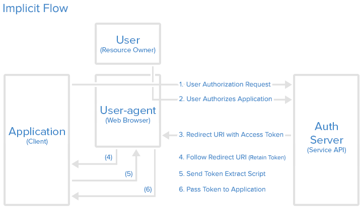

# OAuth 2 Implicit Flow

L'**Implicit Flow** est un mode dégradé de l'[**Authorization Code Flow**](oauth-2-authorization-code-flow.md).

Il est inévitable quand le **Client** est public _\(non confidentiel\)._



1. Le **Client** redirige le **Resource Owner** vers l'**Authorization Server** :  


```javascript
https://accounts.google.com/o/oauth2/v2/auth?
response_type=token
&client_id=CLIENT_ID
&redirect_uri=CALLBACK_URL
&scope=read
&state=...
```

2. Le **Resource Owner** confirme ou rejette les autorisations d’accès demandées sur l’interface proposée par l'**Authorization Server**.

3. L'**Authorization Server** redirige le **Resource Owner** vers le **Client** qui reçoit alors directement l'**Access Token** dans le fragment de l’URL.

```javascript
https://cal-tracker.wishtack.io/oauth/callback#
access_token=ACCESS_TOKEN
&token_type=bearer
&scope=...
&state=...
```

Le fragment est utilisé pour éviter de transmettre l'**Access Token** au service de "hosting" de l'application.

4. Le **User-Agent** suit donc la redirection mais le fragment ne quitte pas le **Device**.

5. Le **Client** exécute alors le code permettant d’extraire l'**Access Token** du fragment.


Certains “User-Agents” coquins ont tendance à perdre les fragments  
[https://bugs.webkit.org/show\_bug.cgi?id=24175](https://bugs.webkit.org/show_bug.cgi?id=24175)



Le **Resource Owner** détient l'**Access Token** et peut donc court-circuiter le **Client** pour communiquer directement avec le **Resource Server**.

Autrement dit, en cas de **man-in-the-middle**, un attaquant peut demander des autorisations au nom du **Client** et utiliser librement l'**Access Token** pour communiquer avec le **Resource Server**.

C’est pour ces raisons entre autres qu’il est recommandé d’utiliser l'[Authorization Code Flow](oauth-2-authorization-code-flow.md).


