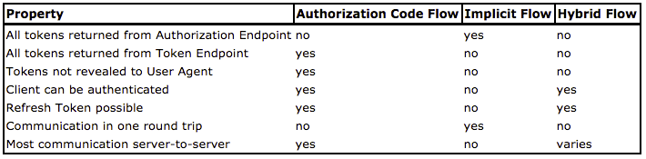

# OpenID Connect Flows

**OpenID Connect** définit 3 flows :

### **Authorization Code Flow**

Il est identique à celui d’OAuth 2 mais on y ajoute quelques paramètres supplémentaires et l'**OpenID Provider** retourne un **`id_token`** qui est un token JWT.  
Cf. [http://openid.net/specs/openid-connect-basic-1\_0.html\#RequestParameters](http://openid.net/specs/openid-connect-basic-1_0.html#RequestParameters)

Dans ce flow, le token JWT est échangé directement entre l'**OpenID Provider** et le **Relying Party** sans passer par le **User-Agent**. La signature du token est simplement une sécurité supplémentaire au dessus de la sécurité du canal TLS.

### **Implicit Flow**

Il est également identique à celui d’OAuth 2 et fournit un **`id_token`**.

On retrouve les mêmes risques et inconvénients qu’avec OAuth 2 avec le risque supplémentaire lié au fait que l'**`id_token`** est un token JWT.

### **Hybrid Flow**

Ce flow permet de fusionner les deux flows précédents.

